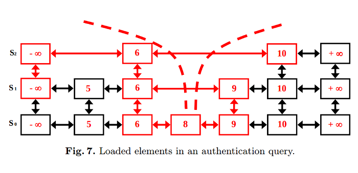

Database Layer For a Blockchain System
===========================================

In this paper we are going to study how authenticated data structures could be used in blockchain systems, what are their desirable properties, and how to achieve them with concrete instantiations in a most efficient way. 

We also are investigating requirements for a database layer of blockchain systems, its basic workflow, operations, properties, requirements.

Authenticated Dictionary
=============================

We refer to a dictionary as to a set of correspondences id -> element (id is unique). A dictionary is authenticated if its going along with a proof of the integrity for each element of the set and the whole set. We state following properties an authenticated dictionary should hold. 

* Root authenticator. A single fixed-size value commits the entire dictionary
* Set-uniqueness. Given set of keys in the dictionary has a unique and canonical representation
* Efficient proofs. The proof returned for a lookup request should be has a size sublinear to dictionary size. The time of a proof verification should be sublinear to dictionary size as well.

Transactions
------------

Transactions within block are to be authenticated. The dictionary of the transactions is not big at all. Currently full blocks in Bitcoin has 1,000-3,000 transactions. So no heavy optimizations are much needed here. 

Authenticated State
-------------------

We can represent the whole state after processing the blockchain as an authenticated dictionary. It is not used in Bitcoin and most of cryptocurrencies of today, but some novel systems like Ethereum are using state authenticating. We expect it will be more widespread in future. Here an optimal solution is much needed. Bitcoin state now is more than 40M elements, each about few hundred bytes. 

Light Clients
-------------

Authenticated structures root values included into a blockchain are useful to build light clients. A light client knows only block headers(so blocks without transactions, with transactions root value, and possibly, state root value also being included). Then a light client can ask a full node some questions, e.g. "provide me transactions associated with a public key pk, with proofs of their existence", or "provide me a payment transactions from Alice to Bob, with an output still not spent by him, along with the proofs".

Block Processing
----------------

Block processing is about to check incoming transactions for validity(signatures and transactional semantics), then to check calculated authenticating root value against one included into the header of the block, then to update state and its authenticating value and check the calculated value against an included into the header of the block.

Consensus protocols
-------------------

IOHK Research has developed an alternative Proof-of-Work consensus protocol, Rollerchain, which requires for support of proofs of non-membership.

Additional properties
---------------------

We state new properties for an authenticated dictionary considering use-cases stated in last three sections:

* Efficient updates. An update occurs on processing of an each block. An update is about to remove a set of elements presenting in a dictionary and also to add a set of new elements. Update should be sublinear to the size of the dictionary.
* Proofs of non-membership. This is needed for Rollerchain, and also useful for different protocols involving light clients.

Possible Implementation options
-------------------------------

- Sparse Merkle Trees
- Merkle-Patricia Trie from Ethereum
- Authenticated Skiplists
- Authenticated Treaps
- Tuple-Based Authenticated Dictionaries(?)

Full-Node Database Layer
========================

This chapter describes how state is being processed in a blockchain system, and what are requirements for a database the system could use. 

Boxes 
-----
A basic element of a state is box. For example, unspent output in Bitcoin is a box. Box has an identifier, usually, a cryptographic hash value for its contents.

Box contains some fields: value, lock(conditions to open it, e.g. a script in case of Bitcoin). 

Block Processing
----------------

In terms of state modification, block processing is about to remove a subset of boxes from a state and append new boxes into it. If state is authenticated(that's optional), then block processing is about an update of a root authenticator also. 

Wallet
------

A lock of a box has a predicate spendableBy(public_commitment_to_a_secret). Each box to append and to remove is to be scanned against a list of public commitments a wallet holds.

Initial Processing
------------------

Load is very different during two different modes of operation. Initial stage of a new node is about downloading a blockchain and process it. The phase is about many hours usually, and block processing(not downloading) is the most significant part of the process. A database can handle this mode explicitly. During initial processing, it is possible to send a batch of updates(blocks) to process, not just one.

Authenticated Data Structure Support 
------------------------------------

Authenticated state is optional. Root is to be updated on each block processing(during initial processing, it could be updated once per batch of blocks).

Rollbacks
---------

Rollback to previous versions are possible. There's some max limit given in settings.

Secondary Indexes
-----------------

A database could build secondary indexes, e.g. around lock values(precisely, public keys corresponding to locks) in order to find quickly who owns what. Secondary indexes are optional.

SkipList notes
==============================================

Some notes from practical implementation of Authenticated Skip List

Root Hash reconstruction
----------------------------------------

Root Hash is verified this way:
 - at start user needs list of all key-value entries. 
 - user creates an empty authenticated Skip List
 - user inserts all entries into Skip List
 - Root Hash from Skip List should match Root Hash from server
 
This approach has performance problem; with large number of  key-value entries, 
user may not have hardware resources to create new Skip List:
 - List of keys consumes `X` disk space, but at least another `1.5*X` is needed to create Skip List.
 - Insertion into Skip List generates random IO. Insertion is only fast if storage fits into memory (RAM). 
   Speed decreases exponentially, if space consumed by Skip List is larger than memory
  
Performance problem can be avoided by creating Skip List from stream. It creates Auth Skip List in reverse order,
without doing any random IO. It is similar to `Data Pump` from MapDB where it imports B-Tree and avoids write 
 amplification. 
 
Stream Import has following properties:
- it needs list of key-value entries sorted in reverse order (Skip List is created from highest key)
- it requires limited memory (`level count * key size`, where `level count` is maximal number of levels in Skip List)
- there is no random IO, result is written into append only file (`FileOutputStream`)

Stream Import can also create Root Hash without creating full Skip List on disk. Skip List nodes are only 
held in memory for short time, before stream moves to different node. It only requires single pass over
Key-Value entries and `level count * key size`. 

Stream Import description
----------------------------

Stream Import takes source data in reverse order. 
It creates Skip List in reverse order, from bottom-right to top-left. 

Import starts by creating single node. Opened reference `->` on left is held in memory together with hash of node it points to:

    -> 9 --> INF

Import continues at three nodes. There are two opened references on left side:

    -> 7 --------> 9 --> INF
       ⭣           ⭣   
    -> 7 --> 8 --> 9 --> INF
   
Six nodes:
   
    -------> 4 --------------------> 9 --> INF
             ⭣                       ⭣
    -------> 4 --------> 7 --------> 9 --> INF
             ⭣           ⭣           ⭣   
    -> 3 --> 4 --> 6 --> 7 --> 8 --> 9 --> INF
    
When last(first in reverse order) element is reached, all open references are closed into Skip List Root:
   
    ROOT
    ⭣   
    1 --------------> 4 --------------------> 9 --> INF
    ⭣                 ⭣                       ⭣
    1 --------------> 4 --------> 7 --------> 9 --> INF
    ⭣                 ⭣           ⭣           ⭣   
    1 --> 2 --> 3 --> 4 --> 6 --> 7 --> 8 --> 9 --- INF

       
       
Stream Import and Hash Path
------------------------------

Stream Import can also calculate Hash Path from reverse sorted data. It construct data similar way, but 
it stores more Skip List nodes in memory to find neighbour nodes.  

Here is an image to illustrate path construction. Source: 
*Authenticated Relational Tables and  Authenticated Skip Lists; Giuseppe Di Battista1 and Bernardo Palazzi*

Skip List and proof of non-existence
----------------------------------------

Authenticated Skip List can also provide proof of non-existence for key `A`:
 - Bottom of the Skip List is an Linked List sorted in ascending order. 
 - To prove non-existence of A we find two neighbours: smaller and greater than `A`
 - Hash Path Proof provides neighbours for each entry on path
 - Hash Path for nearest key smaller than `A`, proves that its neighbour is greater than `A`

   
Appendix 1. IODB Performance Tests 
==================================

We aim to test our database against LevelDB, H2, PostgreSQL, MySQL using BitcoinJ for several scenarios:

* Initial processing: during initial processing more than 400,000 blocks are to be processed in Bitcoin these days. We are taking the scenario to the extreme: test is about to process 1,000,000 batch updates each of 2,000 transactions(how many input/outputs per tx)? The goal is to spend as less time as possible and also to have most compact result in the end(final compaction is allowed).

* Stable regime: after initial processing, a block is coming every 10 minutes in Bitcoin. We are testing this, but the scenarion is assuming larger state and blocks than Bitcoin has, so 500 million outputs(Bitcoin has 40M now), and 10,000 transactions per block(Bitcoin has 2,000-3,000 now). the goal is to have minimum processing time. 

* Frequent rollbacks: for now stale blocks are coming once per 1,000 blocks. We assume a cryptocurrency has much higher frequency of block generation, so stale blocks are coming every 10 blocks in average, forks of length 2 are coming every 100 blocks in average and forks of length 3 are coming every 1000 blocks in average. We are measuring time to rollback to a previous state and then apply a new sequence of blocks. 