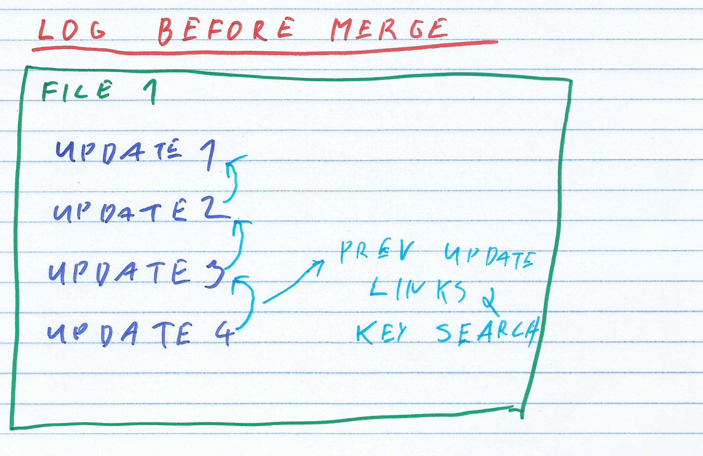
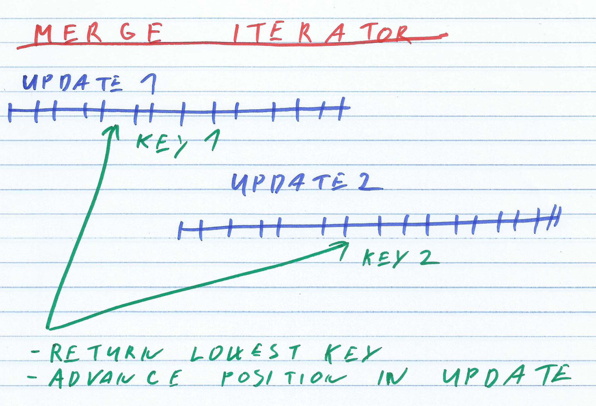
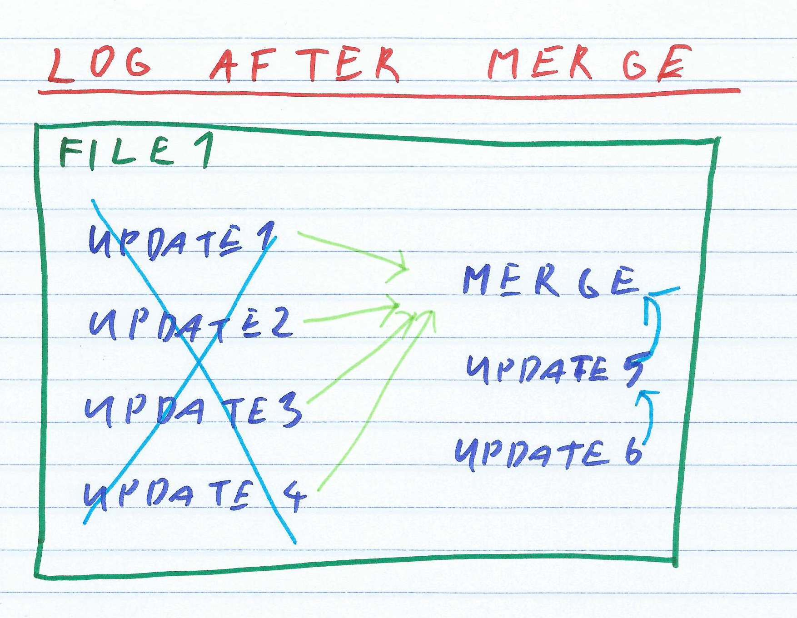
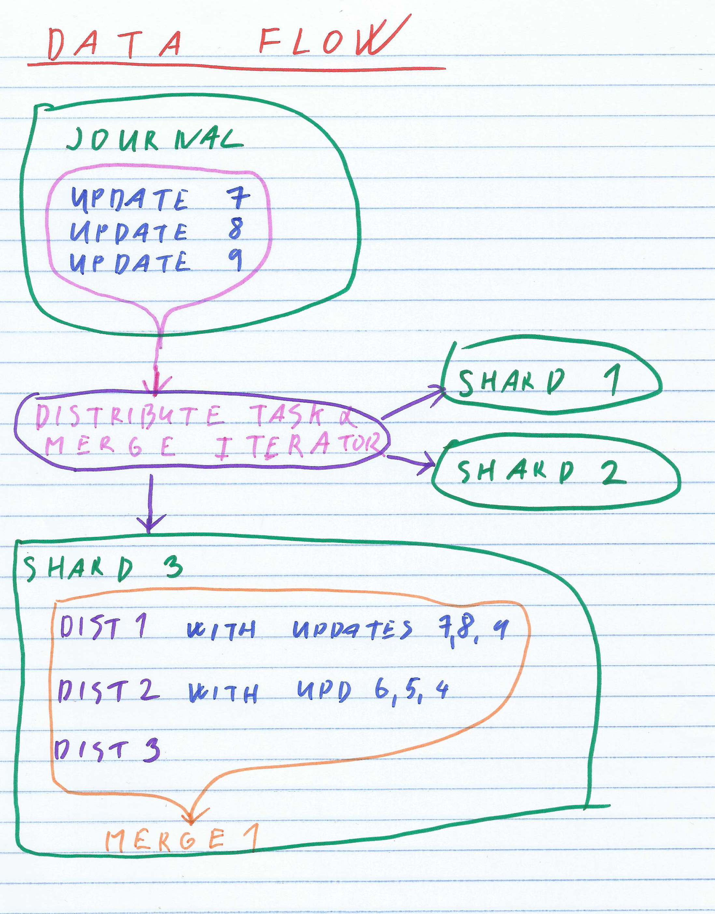
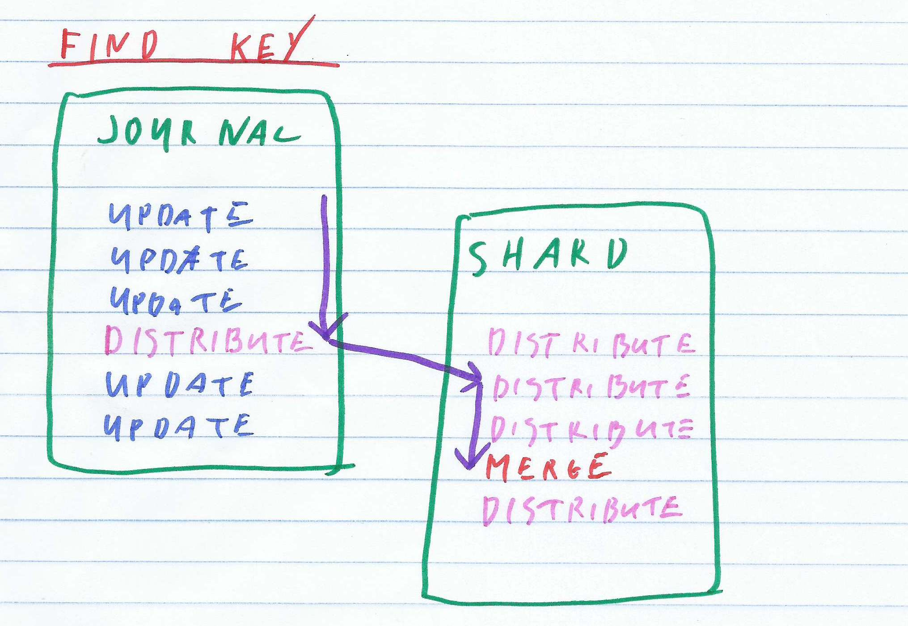
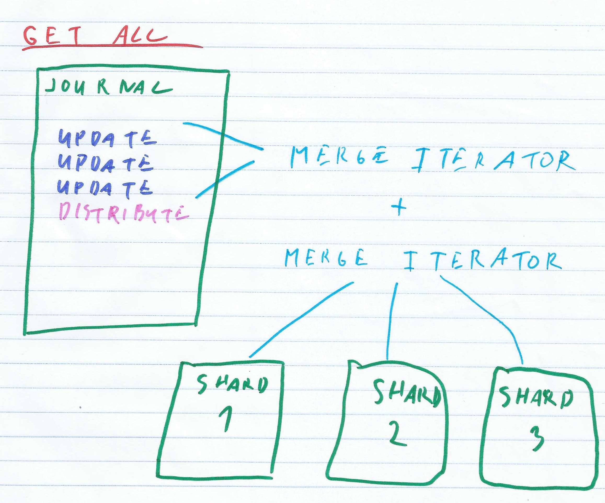
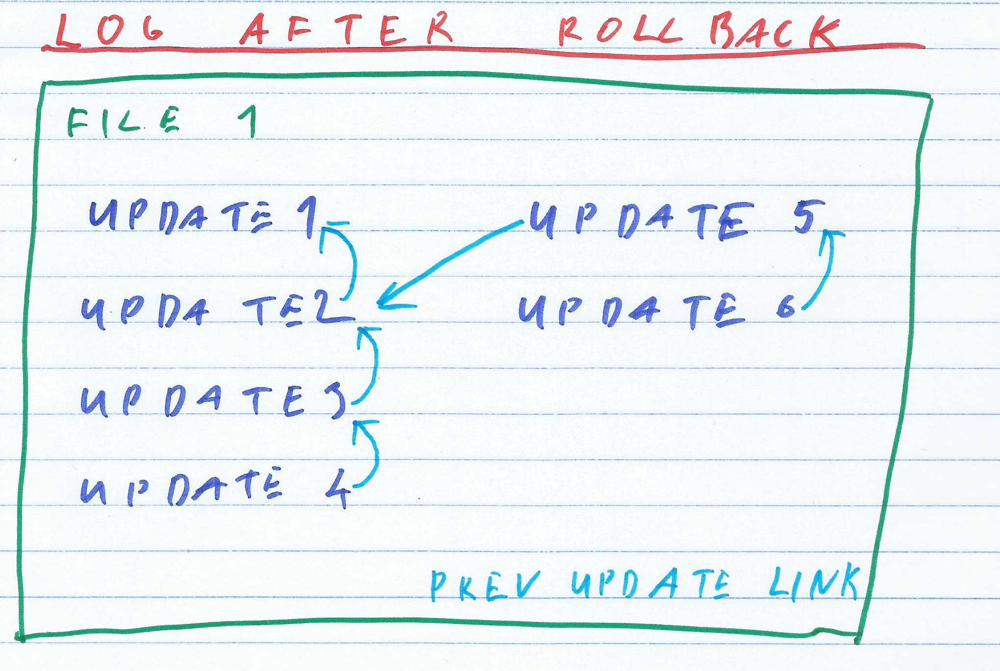

IODB design specification
============================

This document outlines design and implementation of IODB database at 0.4 release.

Basic terms
-----------

This spec assumes basic knowledge of log structured stores.
Here are some basic terms

### Log
- Log is sequence of updates organized by time
    - This sequence might not follow actual organization of data, it can be reorganized by rollback or compaction
- Log can be spread over multiple files.
- Each Log Entry contains:
    - list of update keys
    - list of deleted keys (see tombstone)
    - link to previous update

- Key-Value pair is found by traversing Log until key is found
    - rollback or Compaction can reorganize sequence of updates
    - search follows link to previous update in Log Entry, rather than sequentially traversing log file in reverse order

### State of store
- content of store for given VersionID (or most recent update)
- all key-value pairs in store

### Tombstone

- Already inserted data are immutable. It is not possible to delete keys directly from store.
- Deleted keys are indicated by **tombstone** marker
    - it is special type of value
    - in binary storage is indicated by value with length `-1`
- Compaction eventually removes tombstones from store and reclaims the disk space

### VersionID
- Each Update takes VersionID as a parameter
- Each Update creates snapshot of data
- This snapshot is identified (and can be reverted to) by `byte[]` identifier

### Binary Search

- Keys in each update entry are sorted
- To find a key binary search is used
- It compares `byte[]` (or `ByteArrayWrapper`) with content of file
- All keys have equal size, that simplifies the search significantly
- 0.4 version uses `FileChannel` which is very slow
    - memory mapped file can speedup binary search 10x
    - unsafe file access is even faster

### Merge iterator

- state of store (all key-value pairs) is reconstructed by replaying all updates from start to end
- easiest way is to traverse log and insert key-value pairs into  in-memory `HashMap`
    - that consumes too much memory

- IODB uses Merge iterator (lazy-N-way merge) instead

- Inside each Update Entry (such as V1, V2...), keys are stored in sorted order.

- Compaction reads content of all  Updates  in parallel, and produces the result by comparing keys from all updates.

- The time complexity is `O(N*log(U))`, where `N` is the total number of keys in all Updates and `U` is the number of Updates (versions) in merge.

- Compaction is streaming data; it never loads all keys into memory. But it needs to store `U` keys in memory for comparison.

- If `U` is too large, the compaction process can be performed in stages.

- No random IO, as all reads are sequential and all writes are append-only.

### Merge in log

As the number of updates grows and the linked-list gets longer, Find Key operation will become slow
Also obsolete versions of keys are causing space overhead.

Both problems are solved by merging older updates into a single update.
The merge is typically performed by a compaction process,
which runs on the background in a separate thread.

- Merge process takes N Updates
    - from most recent
    - until previous Merge Entry or start of the log
- It produces Merge Iterator over this data set
- It inserts current state of store into Log Entry

- 0.4 serializes Merge Entry into `byte[]` using `ByteArrayOutputStream`
    - it can run out of memory
    - temporary file should be used instead

### Shards

- If store contains too many Key-Value pairs, Merge or binary search becomes slow
- So the store is split into Shards, each Shard is compacted and managed separately
- Newer data are stored in single log (Journal) latter moved into Shards

Data lifecycle
------------------

IODB moves data around to ensure good performance

### Update

Modifications (updated key-value pairs and keys to delete) are inserted in
batches (here referred as updates).
Each Update is identified by `VersionID` and creates new snapshot which
can be rolled back to.

Over time data (key-value pairs) move following way:

- journal contains most recent updates
- over time journal becomes too long, so Distribute Task is triggered
- at start Distribute Task inserts Distribute Placeholder entry into Journal
- Distribute Task moves data from Journal into Shards
- after Distribute Task finishes, it puts file positions in Shards into Journal
- over time (after some Distribute Tasks are finished) some Shards become too long, this triggers Shard Merge task
- Shard Merge tasks select longest Shard and merges content from multiple Update Entries into single Merge Entry

### find key (get)

`Store.get()` returns value associated with the key, or `None` if key is not found

- search traverses journal, until Distribute Placeholder is found (or key is found)
- from Distribute Entry it takes position in Shard
- search continues by traversing Shards from given position
- search finishes when
    - key is found
    - Merge Entry is found in Shard
    - end of Shard is reached

### get all

`Store.getAll()` returns content of store (all key-value pairs) for given `VersionID` (or msot recent version).

Store content is spread over journal, shards, multiple files.
So the dataset is produced by iterating over multiple files, and using lazy-N-way merge iterator:

- traverse Journal until Distribute Placeholder is found
- take all data in Journal from VersionID until Distribute Placeholder
    - merge them into single data set
    - store it in temporary file (is currently done in-memory and that causes out-of-memory exceptions)
    - this is referred here as Journal content
- iterate over content of shards and merge them with Journal content
    - Shards are not overlapping
    - Journal content is sorted
    - Shard and Journal content is merged on single iteration

Rollback
----------

Rollback reverts store into state at given VersionID. It discards data inserted after
given VersionID.

Log is chain of updates. It is not possible to overwrite new updates during rollback.
So the new update (Offset Alias Log entry) is written into Journal.
It instruct search and other operation to skip irrelevant data while traversing the log.

Rollback is performed in following way
- traverse Journal until matching VersionID is found
- continue Journal traversal until Distribute Entry is found
    - this is first distribute entry after VersionID
    - we need Shard positions for given VersionID
- insert Offset Alias Log Entry into journal
- rollback Shards into state found in Distribe Entry

Shards
------

- binary search on large tables is slow, also compaction on large tables is slow
- only most recent data are stored in Journal
- older data are distributed into shards
- there is Distribute Task, it takes data from Journal and distributes them into Shards

### Shard Splitting

- ideally Shards should be created dynamically
    - small or empty store starts with single shards
    - if Shard becomes too big, it is sliced into several smaller Shards
    - if Shard becomes too small, it is merged into its neighbours

- dynamic Shard allocation has following advantages
    - less configuration, number of shard scales with store size
    - Shard Boundaries are self-balancing
        - if Key Space is sliced at constant intervals, and key distribution is not random (for example incremental keys), most keys can end in single interval
        - with dynamic Shard allocation new shards are created by slicing old Shards.

- 0.4 release has **static sharding**
    - `ShardedStore` has `shardCount` parameter
        - this is hardcoded into store and can not be changed
    - key space is sliced at constant interval
    - dynamic Sharding was in 0.3 release, but caused concurrency issues
on

File naming
----------------------

- Log is composed of multiple files
- IODB stores data in directory
    - this dir contains multiple logs (Journal and Shards)
    - it also contains temporary files

- Each file has prefix, file ID and suffix

- Prefix identifies type of file (journal, shard, temp)
    - It also assigns file into its Log (Journal or Shard)

- File ID gives position of file within log
    - TODO File ID should have two parts; log file position and file version

- Suffix is not used
    - TODO drop suffix or use it to identify temp files

- Temporary files are used
    - To produce merged result during compaction and distribute (TODO currently uses `byte[]`)
    - To store large updates
    - To store result of `getAll()` operation (TODO currently loaded into in-memory `TreeMap`)

File handles and File IO
------------------------

- IODB performs following IO operations on files
    - append at end of the file
    - sync; flush write cache on file (temp files are not flushed)
    - binary search read

- IODB keeps number of files open
    - one writeable handle to append to Journal
    - one readonly handle for each file

- File handle is limited resource
    - by default only 64K handles are allowed per process on Linux
    - exhausting file handles can cause JVM to crash (it can not open DLLs or JAR files)

- IODB keeps file handles in `LogStore.fileHandles` map

- File handle can be `FileChannel` or `MappedByteBuffer` depending on implementation

- file delete
    - IODB needs to delete outdated files
    - files can not be deleted while it is opened for reading (race condition)
        - other threads could fail, while reading data from store
        - memory mapped file crashes (segfault) when accessing unmapped buffer
    - there is semaphore for each file
        - it protects file from deletion while it is read from
        - each read operation needs to lock files it will use
        - see `LogStore.fileSemaphore` for details

Memory mapped files
-------------------

- Current version (0.4) uses `FileChannel` to read files
    - that is very slow for binary search,
    - file caching does not work efficiently
    - `FileChannel` requires seeks and uses extra translation layer

- better way is to use memory mapped files
    - it maps file into memory address space, reads do not require translation
    - binary search is very efficient (10x) faster
    - caching works very well

- memory mapped (mmap) files have some downsides. Those are outlined [in this blog post](http://www.mapdb.org/blog/mmap_files_alloc_and_jvm_crash/)
    - JVM has no official way to close (unmap) mmap files
        - file handle is closed after GC, that can cause JVM process to run out of file handles
    - there is a hack to close mmap file forcibly
        - it is not supported in all JVMs (Java 9, Android etc are different)
        - after unmapping, mmap file can not be read from, it causes access to illegal address and JVM process crashes with SEGFAULT

- memory mapped files can be speedup even more by replacing `byte[]` with primitive `long` for binary search

Background Operations
--------------------------

- IODB performs various maintenance tasks on background

- background task are scheduled automatically in `Executor`
    - see `executor` constructor parameter at `ShardedStore` and `LogStore`
    - if you set `executor` param to null, background tasks are disabled
        - in that case user should perform compaction by calling background tasks directly
        - see `task*()` methods at `ShardedStore` and `LogStore`

IODB performs following tasks

### Distribute Task

- distribute task moves data from Journal into Shards
- it is triggered when number of updates in journal is over limit (see `ShardedStore#journalUpdateCounter`)
    - update count is since last merge, not total count
    - TODO it should be triggered if total space of undistributed updates is over limit, not update count
- can be triggered manually with `ShardedStore.taskDistribute()`

Distribute tasks works in following way:

- insert Distribute Placeholder Log Entry into journal
    - this is to prevent race conditions, journal might be updated while Distribute Task runs
- iterate over Journal Updates, produce list of all updates since previous Distribute Placeholder
- produce iterator over data in Journal Updates
- slice content of iterator into shards
    - only single pass is needed, lazy-N-way merge produces sorted result
    - each Shard is updated with single update
- Journal is updated with Distribute Log Entry
    - it contains pointers to latest updates in Shards
- Distribute Placeholder is replaced by final version of Distribute Log Entry
    - Offset Alias is inserted into journal

### Compact Task

- Distribute Task merges multiple Update Entries into single Merge Entry
- it makes Shards faster and releases unused version data
- it is triggered when number of unmerged updates in Shard is over limit (see `LogStore.umergedUpdatesCounter`)

- can be triggered manually by `LogStore.taskCompact()`
    - TODO expose this in `ShardedStore` as well

It works in following way:

- `ShardedStore` runs background task
    - every N seconds it selects most fragmented Shard
    - if number of unmerged Update Entries (since last merge) is over limit, it calls `LogStore.taskCompact()` on this Shard
- In LogStore it selects Most Recent Update
- It traverses Update Entries until it reaches previous Merge Entry (or start of log)
- It produces merge iterator over all updates in Shard
- It inserts merged content of Update Entries as new Merge Log Entry into Shard
- It replaces Most Recent Update with Merge Entry by using Offset Alias

### File Shrink Task

This tasks replaces old file with new one, and reclaims space in file. It is not present in 0.4 release

TODO current design (0.4) is not very effective to reclaim space released by rollback.

TODO FIG shrink file

Source code overview
------------------------

Some notes:

- key, values and VersionIds in IODB are represented as `byte[]`
    - for practical purposes (hash,comparable) `ByteArrayWrapper` is used

- Basic interface is `Store`
    - it is dictionary that maps key to value

### Quick Store
- it stores all data in memory
    -uses sorted map
- is used as a reference for writing unit tests (other stores should pass the same criteria as simple implementation does)
- uses simple `ReadWriteLock` for thread safety
- can store data on disk using log file
- rollback method replays updates in reverse order
- when opened it replays log file to reconstruct current state (all key-value pairs) into SortedMap

### Log Store

- `LogStore` stores all data in multiple log files
- it uses binary search to find keys
- this class is used for Journal and Shard in `ShardedStore`
- it has background operation that merges multiple Update Entries
    - merge operation uses lazy-N-way merge iterator, so it does not load all entries into heap

- `serialize*()` methods convert updates and other modifications into their binary representation
    - `byte[]` is used right now
    - TODO use temporary files, large updates can cause OOEM exceptions

- `LogStore#append` will take binary data and append it to end of the file

#### concurrency

- `LogStore` is thread safe, but does not have a global lock
- it maintains most state in file

- there is a race condition in file deletion
    - if file is deleted while other thread is reading it, it could cause JVM to crash (see memory mapped files)
    - to prevent that we use file semaphore
    - read operation must lock files it will use
        - delete operation is performed on background, and will not remove files that are locked for reading
    - see `fileSemaphore` and `fileToDelete` fields

- there is a race condition in file append (expand log file)
    - multiple writers should be allowed at the same time, but there is only single file
    - ideally the content of update should be written into temporary file, and latter transferred into log using `FileChannel.transferFrom()` (avoids CPU cache)
    - in 0.4 release append lock is used, so LogStore does not handle concurrent updates

- there is a race condition between `Store.get()` and `Store.update()`
    - `Store.get()` obtains last log file offset from atomic variable, and works with that
        - it can not see future updates

#### Background tasks

- `LogStore` has only one background task
- it merges multiple Updates into single Merge entry
- can be invoked manually with `LogStore.taskCompact()`

### Sharded Store

`ShardedStore` is combination of multiple logs (`LogStore`).
It is composed of Journal and Shards, all are represented by `LogStore`.

- newer data are in Journal
- data are moved into Shards by distribute task
- Sharded Store controls compaction of Shards

### Concurrency

- there is a race condition between rollback and distribute task
    - in 0.4 release rollback operation uses `distributeLock` so the distribute task and rollback can not run at the same time

- there is a race condition between update and distribute task
    - it is solved by using two Distribute Log Entries
        - Distribute Task inserts Distribute Placeholder Log Entry into Journal
        - that is latter replaced by Distribute Log Entry

File format overview
-----------------------

Binary format is described in `store_format.md`

In short log can contain following types of entries:

- **update log entry** - Is inserted on each update
- **merge log entry** - Is inserted by Compaction Task, merges content from multiple updates into single log entry
- **distribute placeholder log entry** - Inserted into journal when distribute task starts.
- **distribute log entry** - Inserted into journal after distribute task finishes. It contains pointers into shards.
- **offset alias log entry** - inserted by Rollback or Compaction Task. It replaces Update Entry with new one. For example after compaction the most recent update is replaced by Compacted Entry.

Unit tests
-------------------

- IODB uses JUnit 4 runner to run unit tests
    - test written in ScalaTest should extend `org.scalatest.junit.JUnitSuite`

#### io.iohk.iodb package
- contains normal unit tests
- there is abstract `StoreTest which tests general contract of `Store` interface
    - it has `QuickStoreRefTest`, `LogStoreTest` and `ShardedStoreTest` subclasses
- most tests extends `TestWithTempDir` class that creates and deletes temporary directory

### bench package
- contains benchmarks
- those are not run automatically, but using `main` method
    - from command line you can trigger it using following command line `sbt 'test:run-main io.iohk.iodb.bench.ClassName'`

### prop package
- properties testing
- generates random data and tries to break store

### smoke
- integration tests
- generates random data and tries to break store
- there is `M1Test` which is acceptance test for 0.4 release

### Long running tests
- by default unit tests run only short time (10 minutes) to make development easier
- however before release full test suite should run for several days to
    - find race condition
    - stress test store
    - test for memory and disk leaks
- Long running test are trigged by `longTest=1` system property
    - from command line use `sbt test -DlongTest=1` to run acceptance