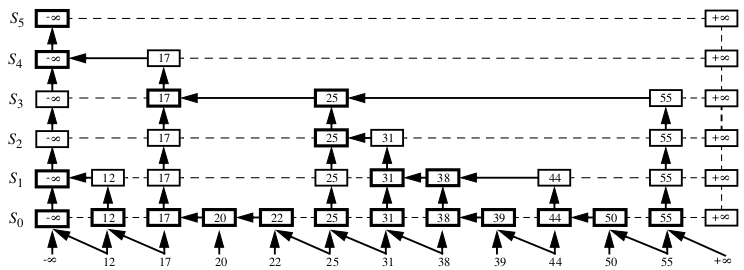

Authenticated Skip List
=========================

Skip List in IODB is based on paper 
[Implementation of an Authenticated Dictionary with Skip Lists and Commutative Hashing]()http://www.ics.uci.edu/~goodrich/pubs/discex2001.pdf).

There are a few important implementation details:

- Original paper uses grid of nodes. 
    - This implementation groups nodes vertically into towers. 
    - Towers are stored in single record
    - Reduce space usage, key is repeated only once for each tower.
    - This improves performance while traversing key (cache locality)
    
- Original paper uses linked list on all levels
    - This implementation removes some unnecessary links. 
    - Each node (or tower) has only single connection. SkipList is effectively tree.
    - This improves update speed
    - It is still possible to traverse tree left or right (find next node at given level). But it requires more complex tree traversal.
    - At figure bellow, only thick line links are used in this Skip List implementation. 
   
-  Hash of Positive Infinity and Negative Infinity is included in  Root Hash. 
    - This implementation uses constant values to represent infinity for this hash. 

