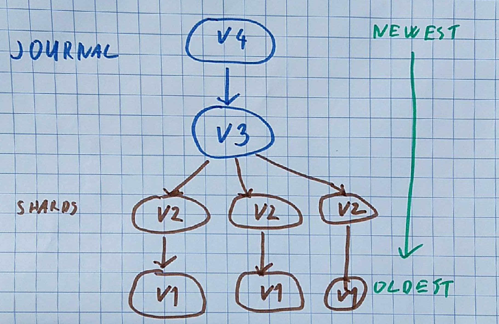
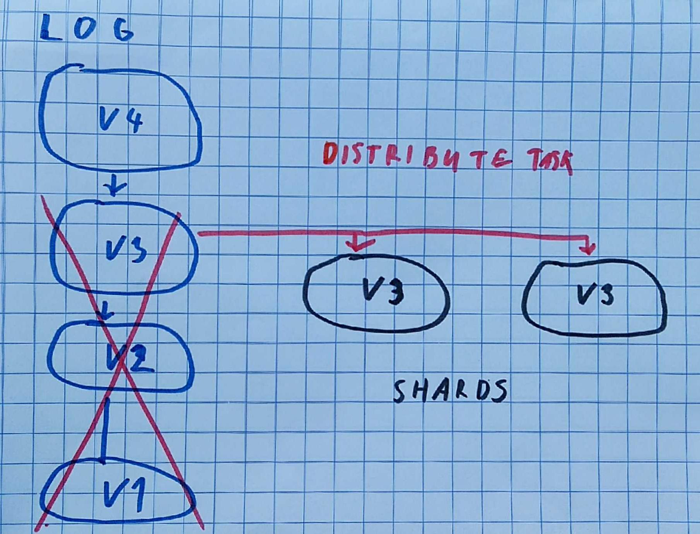

IODB Specification
======================

Features
------------

IODB is embedded storage engine designed for blockchain applications.
It is inspired by [RocksDB](http://rocksdb.org).
It provides ordered key-value store, it is similar to `SortedMap<byte[], byte[]>`.
Its main advantage are snapshots with branching and fast rollbacks.  

Main features include:
* Ordered key-value store 
* Written in Scala, functional interface
* Multi-threaded background compaction
* Very fast durable commits
* Atomic updates with MVCC isolation and crash protection
* Snapshots with branching and rollbacks
* Log structured storage, old data are never overwritten for improved crash protection

Overview
-----------------------

* Key-value store is backed by Log-Structured Merge-Tree inspired by RocksDB and SSTables from Cassandra
    * Some general ideas about LSMTrees are in separate [blog posts](http://www.mapdb.org/blog/lsm_store_and_updates/) 
    * Keys are ordered, store allows range queries

* Modifications are appended to end of file
    * old data are never overwritten
    * Append-only files are more durable than traditional Write-Ahead-Log
    * Writes and commits are faster, only single fsync is needed
    
* There is compaction background process, it merges changes and removes duplicate updates    
    * Compared to similar databases (LevelDB, RocksDB) compaction does not consume too much memory
    * Compaction reads data sequentially and is cache friendly
    * Compaction process does not block reads or writes, store can be modified while compaction is running
    
* Some features are designed for blockchain applications
    * Keys in store have high entropy, compression would not work and is not implemented
    * Version IDs (identifies snapshots) are variable sized `byte[]` (64bit longs would not be enough)
    * Versioning, branching and rollbacks are natively supported without performance overhead
           
           
Dictionary           
------------
Here is explanation of some terms used in this document: 

**Update** - Key updates, modifications and deletes are grouped into batches, all updates are executed in single atomic **Update** (synonym is a commit, transaction or snapshot)  

**Version ID** - Every Update has assigned VersionID . Is supplied by user on each Update, latter can be used for rollback, or to query old snapshot. 

**Update Entry** - Section of Log, it contains modifications performed in single Update  

**Merge Entry** - Section of Log, it contains merged content of multiple Update Operations. (result of all inserts and deletes) 

**Log** - File that contains multiple Update or Merge Entries. More updates can be appended to the end of file. 
   Basic Log structure is described in this [blog post](http://www.mapdb.org/blog/lsm_store_and_updates/).

**Journal** - One or more Log files. It stores most recent modifications.
      
**Shard** - One or more Log files. It contains older data. There are multiple Shards, each contains keys from its interval. Shard intervals are not overlapping.

**Link** - Points to Update, is composed from file number and file offset

Log
----------------

* Log is sequence of Updates 
* Log 
* Update stores Keys in sorted table, binary search is used to find keys in Update
* Deleted keys are represented by tombstones
* Each Update Entry has a Link (file number and offset) to previous Update
* Update Entries are usually organized in single linked list (newer Updates are after older)q
    * Rollback can create branched tree, where last Update Entry in file points somewhere at start of the file

Data lifecycle
----------------------

* All modifications (updates and deletes) are inserted into Journal. 

* There is Distribute Task, it runs in background and distributes data from Journal into Shards.
    * This operation inserts new Update Entries into Shard Log File
    * After data are written to Shards, Journal content might get discarded if their Snapshots are expired
 
* There is Shard Compaction Task, it runs in background and compacts Shards
    * It chooses most fragmented Shard (with most Update Entries)
    * It merges all Update Entries from given shard
    * It writes new Merge Entry into Shard Log
    * Older Update Entries might get discarded (if in separate file, and their Snapshots are expired)
    
    
    

 
### Key search
 
Key (or value) is searched in following way

* Every Update Entry (or Compaction Entry) stores data in sorted order, so the binary search is used to find Key in single Update Entry

* Search starts by traversing Journal from newest to older Update Entry
    * If the Key is found in Journal the search stops
    
* Once Distribute Entry is found in Journal the Journal traversal stops, and search continues in Shard
    * Distribute Entry contains last valid Link (file number and offset) to Shard
 
* Traversal continues in Shard until Merge Entry is found
    * If the Key was not found at this point, it does not exist (Merge Entry contains union of all older Updates)
 
Distribute Task
---------------------

* Distribute Task takes data from Journal and splits them into Shards
 
* It runs in background thread
    * Journal can be updated while it is running, new Update Entries are added to end of Journal file
     
* It merges content from multiple Update Entries from Journal into single sorted iterator
    * Does not have to load entire data set into memory
    
* Once Distribute Task finishes, it updates Journal with *Distribute Entry*, this contains pointers to Shard Update Entries
    * Distribute Entry in Journal indicates that key search should continue in Shard
    
* Once journal content is written into Shards, some Update Entries in Journal can be discarded. 
    * But not if they are needed for rollback
    
### Concurrency
    
Distribute task needs to run without blocking appends into Journal. 
In this case it uses read-only data. File is modified only at the end, but its content remains unchanged.

    
Compaction
----------------

* Compaction merges several Update Entries into single Compaction Entry
    * It removes duplicates and saves space when single Key was modified several times
    * It removes deleted keys (tombstones) from Log and saves space

* Compaction runs in background processes and does not block updates
    * IODB only performs Compaction on Shards, it does not block Distribute Task which updates Shards 
    
* IODB compaction tasks work on small data chunks 
    * Each compaction task should finish within seconds
    * Small data chunks decrease disk space overhead 
    * That improves concurrency
    * Long running tasks are problem in RocksDB and similar storage engines 
    
    
    
* Compaction works following way    
    * Compaction takes Entry Updates from Log
    * It merges their content into single sorted iterator using Merge Sort
    * This content is saved to Log as new Merge Entry
    * Link Alias is than inserted to Log, to make Merge Entry visible

### Concurrency

Compaction needs to progress without blocking other writes. That means that Log must be writeable both for compaction and another updates. 
This is done by using two files and Link Alias:

* Lets say there is file **A** with several Updates, which needs to be compacted
* Compaction closes **A**, no more updates will be appended to it. 
* It opens two new append-only files: **B**, **C**
* **B** is not part of Journal yet, links from **C** are pointing to **B** 
    * Compaction will output its content into file **B**
* **C** is part of Journal, new Updates are appended there
* Once Compaction finishes it fsyncs file **B** and inserts Link Alias into **C** to replace content from **A** with **B**
* At this point file **A** can be deleted, if its content is not needed for rollback

Storage format
----------------

Storage format is described in [separate doc](store_format.md).

Solutions for problems in older versions
--------------------------------------

Older IODB designs had following problems:

* It required too much memory, often it would fail with OutOfMemoryExceptions 
* It required too many file handles
* It was not really concurrent, background operations would block reads and writes
* It took long time to reopen the storage, because all log files needed to be replayed to find latest Updates. 

Here is how it is addressed in IODB

### Memory Usage
* Older version kept HashMap of all Updates in form of `HashMap<VersionID,(FileNumber, FileOffset)`. 
    * This map would grow with number of updates
    * New design only keeps single Link `(FileNumber, FileOffset)` to newest Update Entry
    * All other Links are read from file, while key is searched
* Merge Task would assemble the result on-heap, before it was appended to Log File. 
    * New design dumps data into directly into file
    * It uses lazy-N-way merge, so only needs to keep single Key per Update in memory
    
### File Handles
* Older design used one mmap file handle for each Update
    * Default value on Linux is 64K handles per process, JVM would crash if this was exceeded
    * Current design uses larger files, with single mmap region over sparse file. It is described [in this blog post](http://www.mapdb.org/blog/mmap_files_alloc_and_jvm_crash/)
      
### Concurrency issues
     
* Older design used single lock, to keep its in-memory data structures (shard, update maps) synchronized. 
    * That prevented concurrent operations 
    * It was temporary measure, but I never managed to fix it, and make in-memory data structures concurent
    * New design has very little in-memory structures, all informations are read from Update Entries which are immutable
        * Shard Layout is read from Distribute Entry in Journal
        * Update Layout is read from Update Entries in Journal and Shards
    * Only in-memory structure is End-Of-File pointer stored in Atomic Reference. 
    * There is Append-Lock to prevent two writers from appending to end of log file concurrently
    * Readers does not lock
    * Compaction does not lock
    
    
### Long time to reopen store
 
* Old design had to replay all log files, in order to reconstruct internal data structures, and find the newest Update Entries

* New design only has to replay Journal, typically it means last 100 Updates

* Shard Logs do not have to be replayed. Those are 99% of store size
    * Shard Layout is included in Distribute Entry in Journal
